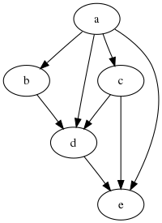
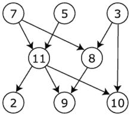

## Пример реализации алгоритма Тарьяна

Суть в том, чтобы обойти все вершины ацикличного графа, используя поиск в глубину. Запоминаем вершину в момент выхода. В процессе обхода помечаем узлы текущей цепочки как "серые". Это поможет опознать цикл.

В результате получим непротиворечивую последовательность узлов.

### Источник графов

https://ru.wikipedia.org/wiki/Топологическая_сортировка

#### Вариант 1:

#### Вариант 2:
